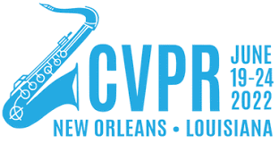
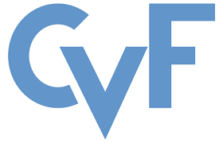
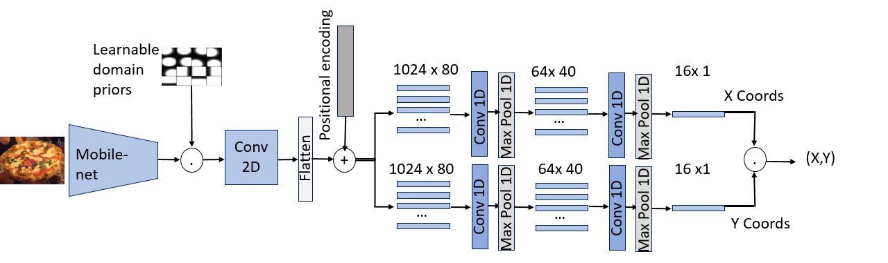
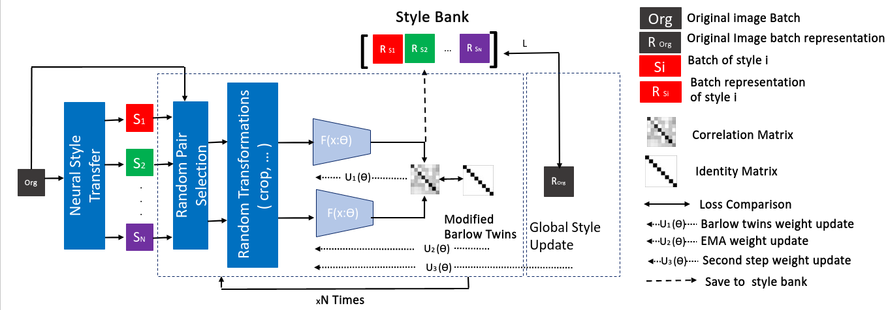
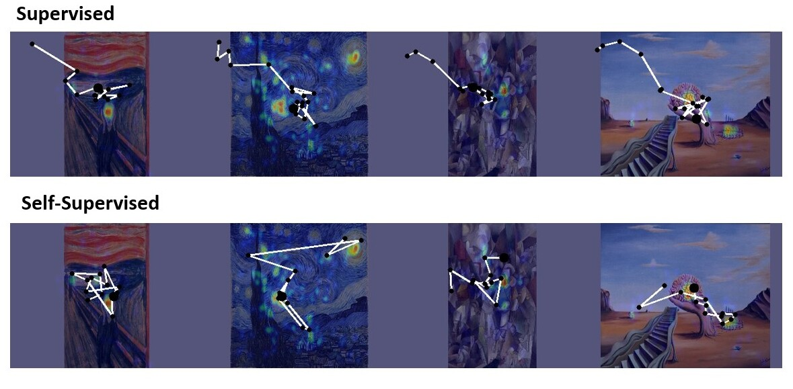

# SSLArtScanpath
---


----





## Abstract 
In our paper, we propose a novel strategy to learn distortion invariant latent representation from painting pictures for visual attention modelling downstream task. In further detail, we design an unsupervised framework that jointly maximises the mutual information over different painting styles. To show the effectiveness of our approach, we firstly propose a lightweight scanpath baseline model and compare its performance to some state-of-the-art methods. Secondly, we train the encoder of our baseline model on large-scale painting images to study the efficiency of the proposed self-supervised strategy. The lightweight decoder proves effective in learning from the self-supervised pre-trained encoder with better performances than the end-to-end fine-tuned supervised baseline on two painting datasets, including a proposed new visual attention modelling dataset.


## Model Architecture


## Self-Supervised Learning Training Approach 



## Reuslts

### AVAtt Painting Dataset (Ours)
 


# Citation

Please cite the following papers for this project: 

```bibtex
@InProceedings{Tliba_2022_CVPR,
    author    = {Tliba, Marouane and Kerkouri, Mohamed Amine and Chetouani, Aladine and Bruno, Alessandro},
    title     = {Self Supervised Scanpath Prediction Framework for Painting Images},
    booktitle = {Proceedings of the IEEE/CVF Conference on Computer Vision and Pattern Recognition (CVPR) Workshops},
    month     = {June},
    year      = {2022},
    pages     = {1539-1548}
}
```

# Intructions 


The repo relies on <a href="https://pytorch.org/get-started/locally/">Pytorch</a>, and <a href="https://pytorch.org/get-started/locally/">torchvision</a> libraries.


